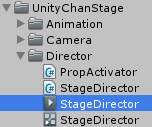
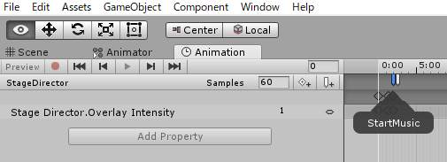
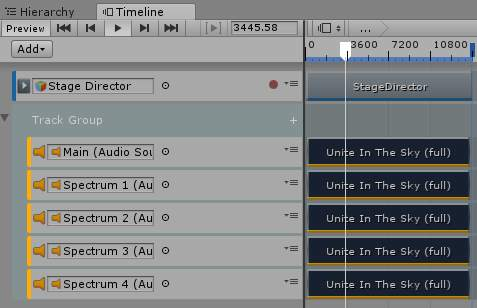

# UnityChan CRS 解読メモ

* Unity2017.2.0f3

## Assets/UnityChanStage/Director/StageDirector.csを[PlayableDirector](https://docs.unity3d.com/Manual/class-PlayableDirector.html)に置き換えてみる

[プロジェクトの基本構造について](https://github.com/unity3d-jp/unitychan-crs/wiki)の解説によると

> Stage Director はアニメーションカーブとアニメーションイベントによって制御されています。

とある。

なるほど。

StageDirector.csを読むとAwakeで各種Prefabのインスタンス化と、アニメーションクリップStageDirectorから発生するアニメーションイベントを受け付けていることがわかった。

StartMusic, ActiveProps, SwitchCamera(int 0), StartAutoCameraChange, StopAutoCameraChange, SwitchCamera(int 1), FastForward, StartAutoCameraChange, StopAutoCameraChange, StartAutoCameraChange, StopAutoCamraChange, SwitchCamera(int 2), EndPerformanceが設定されていた。

やってみよう。

### 新規タイムライン

Timeline Windowを開いてヒエラルキーでStageDirectorを選択して、Timeline Windowのcreateを押す。Assets/StageDirectorTimeline.palyableで保存した。
Timelineのトラックに、StageDirectorアニメーションクリップを投入。
これでTimelineからStageDirectorのAnimatorを駆動するようになったので、AnimatorからControllerを取り除く。
再生してみる。
StageDirectorのOverlayIntensityに注目していると値が流れ込んでいることがわかる。
・・・しかし、音が鳴らぬ。
どうやらアニメーションクリップイベント(StartMusic)が来ていないぽい。
使い方が悪いのか現状そういうものなのかよくわからないが、イベントはTimeline上に別のトラックとして移植していくことにしよう。

### MusicPlayer

MusicPlayerプレハブをシーンにインスタンス化。
StageDirector.csからMusicPlayerのプレハブをインスタンス化するコードを削除。
TimelineにAudioトラックを追加して``Unite In The Sky(full)``を投入。
StageDirectorアニメーションクリップのStartMusicのタイミングを確認して、``Unite In The Sky(full)``クリップの始まる時間を2秒に設定。
AudioトラックのAudioSourceにMusicPlayerの子オブジェクトMainを設定。
再生してみる。
・・・曲と踊りのタイミングがあっていないような。
PlayableDirectorのUpdate MethodをUnscaled Game Timeに変えてみたら良くなったような気がする。
Spectrum 1, 2, 3, 4用のAudioTrackをコピペで追加した。

### CandyRockStarとLipSyncController(Prefabs On Timeline)

次はUnityちゃんをタイムラインに乗せてみよう。

* [Candy Rock Star をさわってみた#05 ～ ユニティちゃんのアニメ連動移動制御](https://dennou-note.blogspot.jp/2014/12/candy-rock-star-05.html)

CandyRockStarとLipSyncControllerプレハブをシーンにインスタンス化する。
TimelineにAnimationTrackを追加して``UnityChan/Animations/C86unitychan_003_NOT01_Final/003_NOT01_Final``アニメーションクリップを投入し、アニメーターにCandyRockStarを設定。
同様にAnimationTrackを追加して``UnityInTheSky/Animation/LipSync/Take001``アニメーションクリップを投入し、アニメーターにLipSyncControllerを設定。
CandyRockStarとLipSyncControllerのAnimatorからControllerを取り除く。
再生してみる。
それなりいうまく動いてタイムラインをシークすると音楽とモーションが同期するようになった。
しかし、UnityChanが最初目を閉じなくなったなど微妙動きが違う。
もともとAnimatorで設定していたアニメーションレイヤーFaceとHandExpressionが無い状態になったためだ。これは、後に回して先に進めよう。

今後の課題。

* アニメーションレイヤー
* FastForward(ショートバージョン対応)

### CameraRig

### Overlay

### Confetti, Stage, CandyRockStar, LipSyncController, Back Screen, Back Screen Camera Rig, Background, Character Light, Visualizer

## default Timeline

## PostEffect

## UnityChan Shader

## 歌詞

## CameraMachine

## 動画

## Gif動画

