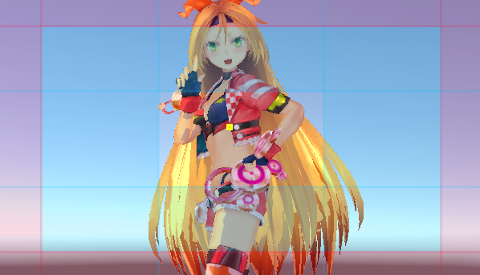
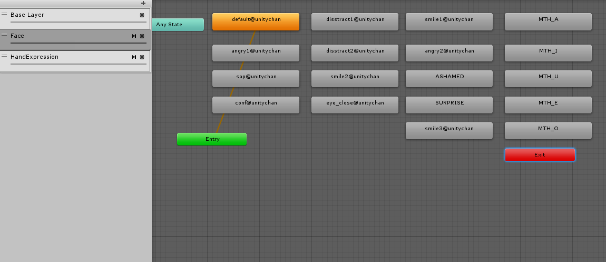
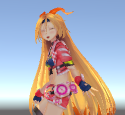
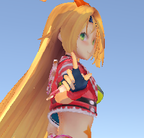

# UnityChan CRS 解読・改造メモ

* Unity2017.3.0f3
* Unity2017.2.0f3

## やり直し
わかりずらくなってきたので新しいシーンで整理する。
新規シーン。

Emptyを作ってTimelineを作成。
UpdatedMethodを``DSP Clock``
Wrap Modeを``Hold``にする。
トラックを削除。

## UnityChanと曲の開始タイミング
シーンに``Assets/UnityChan/Prefabs/CandyRockStar``プレハブをインスタンス化。
Animatorからコントローラーを取り外し。
AnimationTrackを作成してCandyRockStarをバインド。``Assets/UnicyChan/Animations/C86unitychan_003_NOT01_Final/003_NOT01_Final``アニメーションクリップを投入。

AudioTrackを作成して``Aasets/UniteInTheSky/Unite In The Sky(full)``オーディオクリップを投入。

再生しながら曲の開始タイミングがモーションに合うように調整する。
* 900フレームくらいのUnityちゃんが上を向いて動き出すたあたり
* 1860フレームくらいの歌い出し

を繰り返し再生してこの辺かなというところに決めた。

* 126フレームにした(60フレーム換算で2秒くらいなので元々そんなもんである)

アニメーショントラックを基準として曲のタイミングが合うようになった。

``Assets/UniteInTheSky/Prefabs/LipSyncController``プレハブをインスタンス化。
Animatorからコントローラーを取り外し。
AnimationTrackを作成してLipSyncControllerをバインド。``Assets/UnityInTheSky/Animations/LipSync/Take 001``アニメーションクリップを投入。

UnityChanのモーションのトラックに``Add Overlay Track``する。トラックのAvatarMaskに``HandOnlyMask``をセット。
``Assets/UnityChan/Animations/Hand_Expression/HandExpression``アニメーショントラックを投入。

見切れないようにCinemachineのVirtualCameraを設置。
vcamの``Look At``に``CandyRockStar/Character1_Reference/Hips/Spine/Spine1/Spine2/Camera Target``をセット。
Cinemacineトラックを作ってMainCameraをバインド。クリップを作成してモーションと同じ長さに設定して、virtual cameraに作ったvcamをセット。



何もないUnity空間で音楽に合わせてユニティちゃんが踊るようになった。
LipSyncとHandExpressionは動いている。
パーティクルもタイムラインに乗せられるらしいので曲に合わせてOn/Offしようかと思ったのだけどうまくいかなかったので後回しに。

## 表情トラックを作ろう

もともと以下のような流れで表情は制御されていた。

* HandExpressionアニメーションクリップ 
* => アニメーションクリップイベント 
* => FaceUpdate.OnCallChangeFace(state_name) 
* => Animator.CrossFade(state_name, 0)



* => stateにセットされたアニメーションクリップが作動。
* => 表情用のアニメーションクリップ群は、ひとつだけキーが打ってあってBlendShapeの設定値が記述されている。
* => SkinnedMeshRendererのBlendShape値が変更される。

HandExpressionのアニメーションクリップを眺めるとそこまで激しく表情が変化しているわけではないので、
トラック化してタイムラインに移植してみよう。

* FaceUpdate.animationsに設定してあるAnimationClipをScriptableObject化
* ScriptableObjectをクリップとしてSkinedMeshRendererに適用するトラック
* HandExpressionアニメーションクリップからアニメーションクリップイベントを取り出してBlendShapeTrackに投入してScriptableObjectを設定する補助スクリプト 

を作った。


表情が変化するようになった



[ソース](../Assets/g_Custom/Scripts/BlendShapeClip)

トラックの作り方が分かってきた。

## EyeTarget

カメラ目線にすべく調べてみると、DeltaLookAtAxisというのがUnityちゃんに含まれているとあり実際動かすことができた。

```cs
public class LookAtTarget : MonoBehaviour
{
    [SerializeField]
    DeltaLookAtAxis[] m_eyeLocators;

    void LookAt(Transform eye, Transform target)
    {
        var dir = (target.position - eye.position).normalized;
        var d = Quaternion.FromToRotation(eye.forward, dir);
        eye.transform.rotation *= d;
    }

    void Update()
    {
        foreach (var x in m_eyeLocators)
        {
            LookAt(x.transform, transform);
        }
    }
}
```

* Multiplyer x=0.2
* Multiplyer y=0.1

くらいの設定がよさげだった。
もう少し調べると不通にMecanimHumanoidのLookAt IKでいけるとあったのでそっちもやってみた。

```cs
public class IKUpdater : MonoBehaviour
{

    [SerializeField]
    Animator m_animator;

    [SerializeField]
    Transform m_lookAt;

    [SerializeField, Range(0, 1)]
    float m_lookAtWeight;

    private void Reset()
    {
        m_animator = GetComponent<Animator>();
        m_lookAt = Camera.main;
    }

    private void OnAnimatorIK(int layerIndex)
    {
        Debug.Log("OnAnimatorIK");
        m_animator.SetLookAtWeight(m_lookAtWeight);
        m_animator.SetLookAtPosition(m_lookAt.position);
    }
}
```

LookAt更新用に作ったのだけど、``OnAnimatorIK``が呼ばれなかった。
・・・タイムラインを使っているときにIKを使えるのかよくわからないな。
わかったら使うとしてとりあえずDeltaLookAtAxisを使う。



ついでにAutoBlinkを有効にした。
ずっとAutoBlinkだと干渉する場合があるのでActivationTrackを追加して、Unityちゃんが``default@unitychan``の時だけAutoBlinkが有効になるようにしてみた。

## memo
* [StageDirectorをTimeline(PlayableDirector)で置き換える](timeline.md)
* [DefaultPayable導入](defaultplayable.md)
* [Post-processing Stack導入](postprocessing.md)
* [Cinemachine導入](cinemachine.md)

以下気になっているところ

* ユニティちゃんトゥーンシェーダー2.0導入
