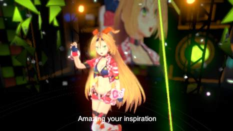

# [Default Playables](https://www.assetstore.unity3d.com/en/#!/content/95266)を取り入れる

Timeline化を果たしたのでDefaultPlayablesで遊んでみよう。

* [【Unity】"Default Playables"で、VideoPlayerやTextをタイムラインで制御したりFadeoutやTweenしたり](http://tsubakit1.hateblo.jp/entry/2017/07/14/215906)

## TextSwitcherTrackで歌詞を入れてみよう

シーンにUI - Textを作成。TextのTransformをResetして画面中央にして、Textを空文字列にする。
SceneViewを2DにするとAssets/Visualizer/MirroRefectionからエラメッセージが出るようになってしまうので対処

```
Assertion failed: Screen position out of view frustum (screen pos 1024.000000, 0.000000, 1030676.000000) (Camera rect 0 0 1024 1024)
```

```cs
	public void OnWillRenderObject()
	{
		if (!enabled || !GetComponent<Renderer>() || !GetComponent<Renderer>().sharedMaterial || !GetComponent<Renderer>().enabled)
			return;

		Camera cam = Camera.current;
		if (!cam)
			return;

        // ここ追加
        if (cam.orthographic)
        {
            return;
        }
```

TimelineにDefault Playablesで追加された``Text Switcher Track``を追加。オブジェクトに最初に作った``UI-Text``を設定。
クリップを適当に追加再生してみる。

[Unityちゃん](http://unity-chan.com/)からキャラクターソング・アルバム Vol.1「UNITE IN THE SKY」入手。

裏ジャケットに書いてある歌詞をテキストに起こして曲を聴いてだいたいの時間を追加した。

```
[00:27]存在的には 潜在？
頭の中は 無限大∞
[00:31]混沌都市 現代に
うれしはずかし 木霊し 参りまして
```

テキストからクリップを投入するツールを作ってみる。
Editorで完結させたいところだがとりあえずプレイしたら動作するものを作る。

* [TimelineAssetをEditor用Scriptから生成するメモ](https://qiita.com/furai13/items/d2048d49dde45823b3de)

わからんかった。
TimlineClipを作って時間を指定するところまではできたが、
TextSwitcherClipに固有のtext等を設定する方法が不明。
残念。

* [TextSwitcherTrackUtil](../Assets/TextSwitcherTrackUtil.cs)

以下のような感じになっているような気はするのだがPlayableのAPIがわかってからやろう。

```
runtime              asset
====================================
                     TimelineAsset
                           ↓
                     TrackableAsset
                           ↓
PlayableBehaviour -> PlayableAsset
```



## Trackを自作してみる

* [【Unity】Timelineの独自Playableを超簡単に作るウィザード](http://tsubakit1.hateblo.jp/entry/2017/10/15/195736)

